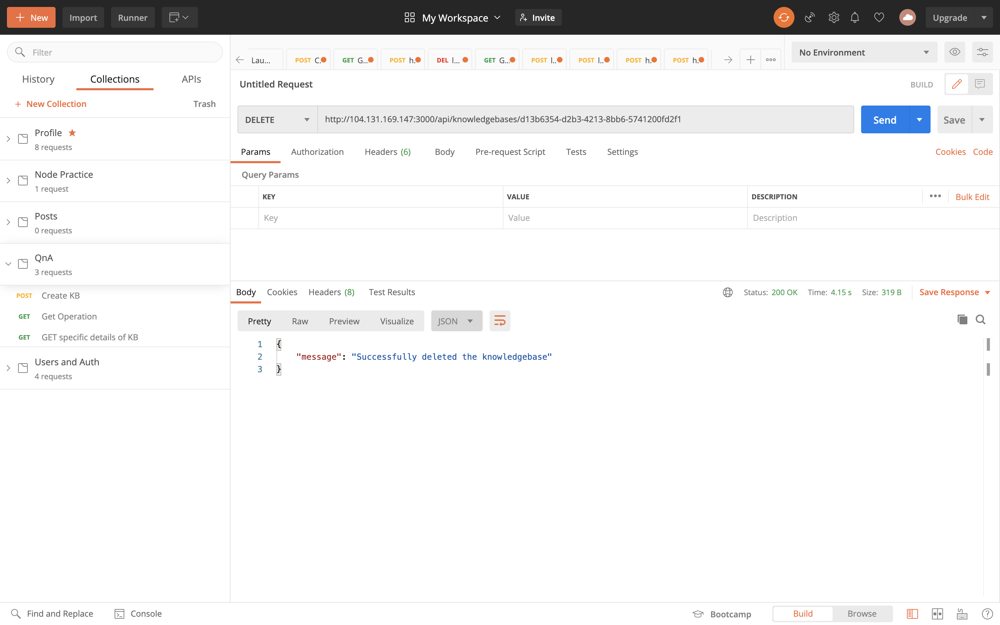

# API For QnA Cognitive Service
## Akhil Chundarathil

The API's presented in the project communicates with a cognitive service that lets you create a conversational question-and-answer layer over your existing data. This API can be used to build a knowledge base by extracting questions and answers from your semi-structured content, including FAQs of online pages. This can answer users’ questions with the best answers from the QnAs in your knowledge base—automatically. Your knowledge base gets smarter, too, as it continually learns from user behavior.

# This API's can provide you below services.

 - Create a Knowledgebase of QnA Pairs
 - Monitor the status of operation initiated to create the Knowledgebase
 - Get the details of particular knowledgebase
 - Publish the knowledgebase into production index so that it can be queried
 - Query the knowledgebase by asking a question
 - Delete a Knowledgebase
 
 > **The Base URL for this API service is,** <br/> http://104.131.169.147:3000/api/
 <br/>
 
 > **The API working functionality can be tested at,** <br/> [QnA API Documentation](http://104.131.169.147:3000/api-docs/)

<br/>

# Four Endpoints exists for this service:

 - /knowledgebases
 - /operations
 - /publish
 - /query
 
 <br/>
 
# **Using the API with `POSTMAN`**

---
## 1. Creation of Knowledgebase

### Endpoint: `/knowledgebases`
- Send a `POST` Request to the endpoint to the above endpoint `http://104.131.169.147:3000/api/knowledgebases` with the following schema:

```JavaScript
{
  "name": "Knowledgebase1",
  "qnaList": [
    {
      "answer": "Hello, How are you",
      "questions": [
        "Hey",
        "Hi",
        "Hello"
      ]
    }
  ],
  "urls": [
    "https://docs.microsoft.com/en-in/azure/cognitive-services/qnamaker/faqs"
  ]
}
```
  - `name` : Name of the knowledgebase
  - `qnaList`: List of object containing answers and questions to store it in the knowledgebase
  - `urls`: List of urls that can be used to extract QnA from FAQs, maunuals, etc.
 
- The above post request creates a knowledgebase with given QnA pairs
- The successful response will return a operation id. This can be used to monitor the status of the operation using another endpoint `/operations` to know the status of the operation. We can poll this endpoint to know the status of the operation


  
 
 - As you can see from the above success response, it returned an operation object.
 
## 2. Status of the intitated operation of the Knowledgebase

### Endpoint: `/operations`

- Send a `GET` Request to the endpoint to the above endpoint `http://104.131.169.147:3000/api/operations/{operationid}`
  - `operationid` : id in the operation object returned after requesting for creation of knowldgebase
 
- The above request gets the status of the operation initiated in the server

- The successful response will return the success state with the id of the knowledgebase created


  
 
 - As you can see from the above success response, it returned the id of the kb created.
 
## 3. Get the details of a specific knowledgebase

### Endpoint: `/knowledgebases`

- Send a `GET` Request to the endpoint to the above endpoint `http://104.131.169.147:3000/api/knowledgebases/{knowledgebaseId}`
  - `knowledgebaseId` : id of the knowledgebase
  
- The above request gets the details of the knowledgebase using this id
 
- The successful response will return the details of the knowledgebase created


  
 
 - As you can see from the above success response, it returned the details of the kb created.
 
## 4. Publishing the knowledgebase

### Endpoint: `/publish`

- Send a `POST` Request to the endpoint to the above endpoint `http://104.131.169.147:3000/api/publish/{knowledgebaseId}`
  - `knowledgebaseId` : id of the knowledgebase
  
- The above request publishes the knowledgebase so that it can be queried
 
- The successful response will return the success message


  

**Note** : _`This service can only publish two knowledgebases. To publish the third one, we have to delete any of the already published knowledgebases.`_
  
## 5. Querying the knowledgebase

### Endpoint: `/query`

- Send a `POST` Request to the endpoint to the above endpoint `http://104.131.169.147:3000/api/query/` with the below schema

```JavaScript
{
  "question": "Hi",
  "knowledgebaseId": "d13b6354-d2b3-4213-8bb6-5741200fd2f1"
}
```
- `question`: Question that can be queried
- `knowledgebaseId`: id of the knowledgebase that can be queried for 

  
- The above request queries the knowledgebase with a question
 
- The successful response will return the answer matched to that question with a score


 
## 6. Deleting a knowledgebase

### Endpoint: `/knowledgebases`

- Send a `Delete` Request to the endpoint to the above endpoint `http://104.131.169.147:3000/api/knowledgebases/{knowledgebaseId}`
  - `knowledgebaseId` : id of the knowledgebase
  
- The above request deletes the knowledgebase using this id
 
- The successful response will return the successful deletion of the knowledgebase


  
 
## 7. Get all the existing knowledgebases

### Endpoint: `/knowledgebases`

- Send a `GET` Request to the endpoint to the above endpoint `http://104.131.169.147:3000/api/knowledgebases/`

- The above request returns the list of the existing knowledgebases
 


 

